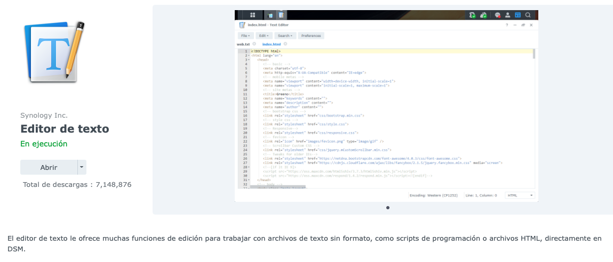

# Utilizar tarjeta nvidia en DS918+,DS920+. DDS923+...

En este tutorial vamos a ver de que manera podemos usar una tarjeta grafica nvidia en un modelo no “compatible” con tarjeta nvidia de serie como los DVA 3221 y 3219.
Modelos confirmados:
-	DS918+
-	DS920+
-	DS923+
-	DS1520+
-	DS1621+
-	DS2422+

Los modelos XS no son compatibles.

##
### Preparación:

Añadimos este repositorio de origenes de paquetes:

https://spk7.imnks.com/


Y nos instalamos el paquete NVIDIA Runtime Library


##
### Parchamos el controlador:

Una vez instalado reiniciamos nuestro Nas. Cuando reinicie nos conectamos por SSH y no logueamos como root

```
sudo -i
```
Una vez como root copiamos y pegamos esto:
```
cd /var/packages/NVIDIARuntimeLibrary/conf && mv -f privilege.bak privilege
```

```
cd /var/packages/NVIDIARuntimeLibrary/scripts && ./start-stop-status start
```

Comprobamos que todo esta correcto con estos comandos:

```
nvidia-smi -pm 1
```

```
ls /dev/nvid*
```
Si todo esta correcto deberíamos ver algo así:


Ahora comprobamos que este instalado el controlador y la tarjeta grafica este reconocida


##


### Usar nuestro servidor multimedia con NVIDIA:

Hay que tener en cuenta que Synology lleva su ritmo a la hora de las actualizaciones y como hemos podido observar el controlador que nos instala el paquete NVIDIA Rumtime Library es la versión: NVIDIA-SMI 440.44
Eso puede generarnos un problema con nuestros servidores de medios que requieran versiones superiores, como caso de Plex, Jellyfin y posiblemete Emby.


#### Plex:

- Puesto que la versión de Plex Media Server v1.20.2 requiere como mínimo el controlador de nvidia 450.66, tenemos que instalarnos la versión de Plex modificada para no tener problemas con el controilador, de este repositorio de paquetes.


- También vamos a necesitar instalarnos este paquete de Synology puesto que lo necesitaremso para modificar el archivo Preferences.xml





- Abrimos el editor de texto recién instalado abrimos el archivo Preferences.xml ubicado en: /PlexMediaServer/AppData/Plex Media Server


```
HardwareDevicePath="/dev/nvidia0"
```


