# Instalar  GPU nvidia y actualizar el controlador a la versión 5xx
#

En este tutorial vamos usar una tarjeta grafica nvidia e instalar el controlador 5xx.
<br>
<br>
Esta versión del controlador nos permitirá actualizar nuestros servidores de contenido como Plex, emby etc… y no tener la limitación que teníamos antes ya que estábamos usando el controlador 440. La ventaja de este nuevo controlador es que puede usarse para GPU como para VGPU (Virtual GPU). de momento vamos a ver como se instala en una grafica física.
<br>
<br>
El merito es del usuario: [pdbear · he/him](https://github.com/pdbear/syno_nvidia_gpu_driver) y del equpo de desarrollo de kkk.

Las tarjetas compatibles son las mismas que podriamos usar en los DVA.
<br>
Como característica especial:
<br>
- El controlador se actualiza a la versión: 5xx
- Funciona en la mayoia de modelos DSM cuya plataformas sean x86_64 con la versión del núcleo 4.4.302+. (7.2)
- Aun no sirve para aprovechar los recursos de IA de surveillance station DVA

### Preparación:

Añadimos este repositorio de origenes de paquetes:

https://spk7.imnks.com/


<br>

### Si teníamos una versión anterior o diferente, debemos desinstalarla antes y reiniciar nuestro equipo. 

<br> 
<br>

 Instalamos el paquete NVIDIA GPU Driver 

<br>

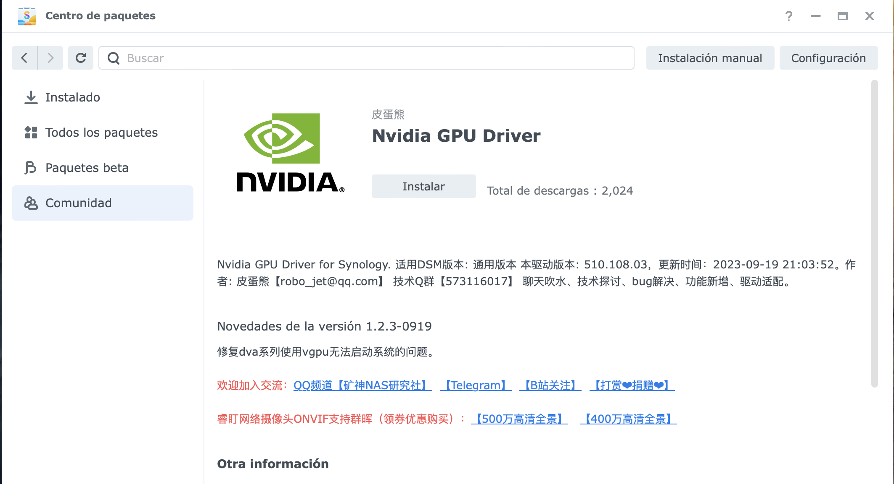

<br>

Cuando nos lo pida, aceptamos los términos y empezamos la instalación.

<br>

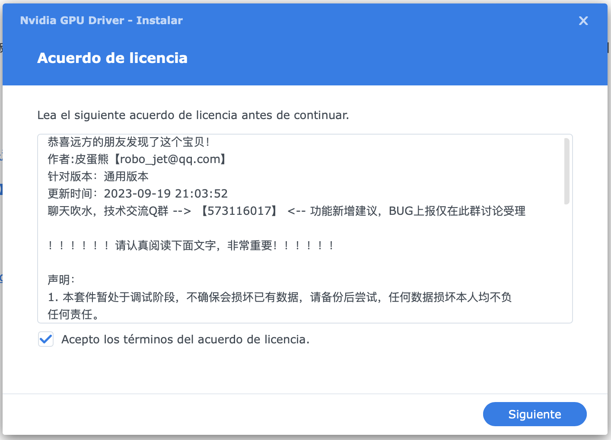

<br>

En este paso importante elegir GPU.

<br>

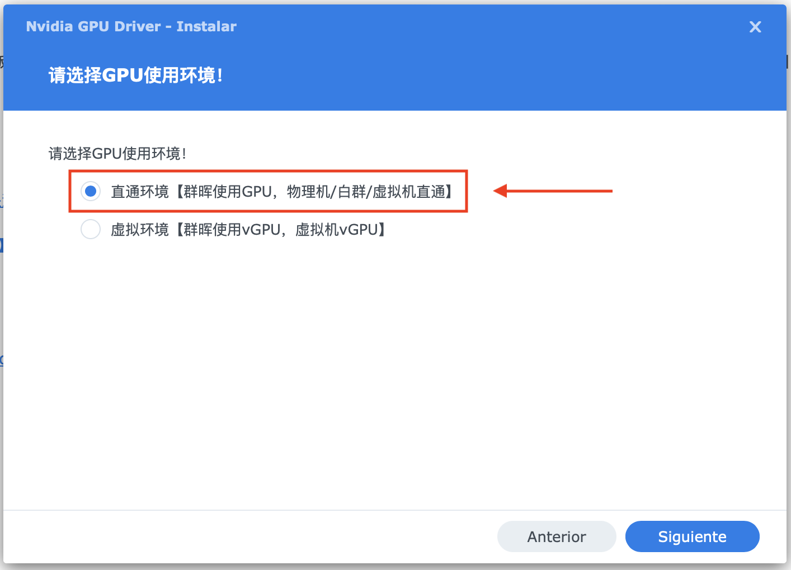

<br>

Aquí lo dejamos como esta, ya que esta opción es para las VGPU que no es nuestro caso ahora y seleccionamos siguiente.

<br>

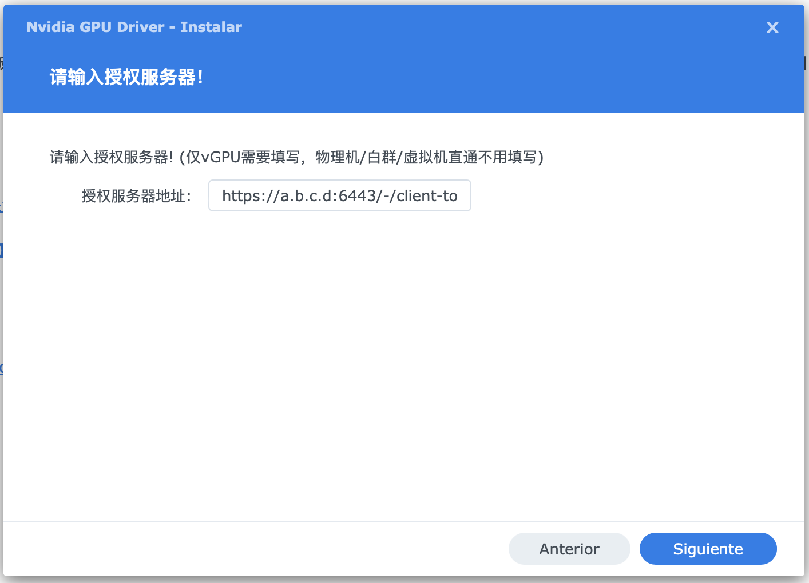

<br>

Y finalizamos la instalación.

<br>

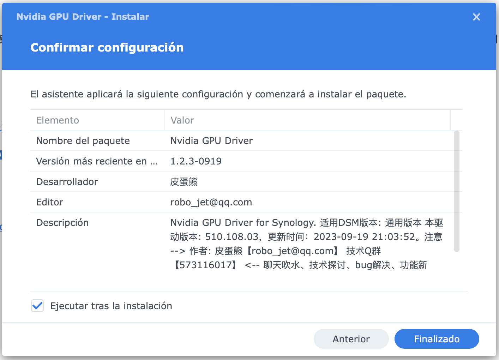

#

Una vez instalado nos conectamos por SSH y no logueamos como root

```
sudo -i
```
Una vez como root copiamos, pegamos esto y ejecutamos:
```
vgpuDaemon fix
```
<br>

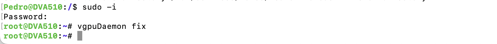

#

¡Ahora importante!! vamos al centro de paquetes y nos dirigimos a los que tenemos instalados y detenemos el controlador de nvidia, una vez detenido lo volvemos a ejecutar.

<br>

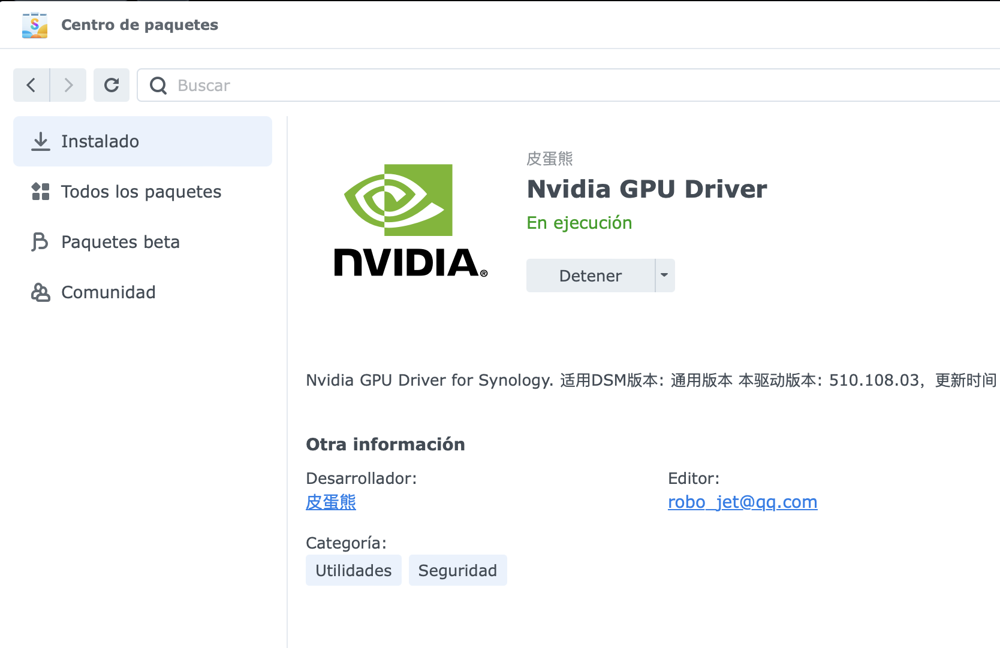

<br>


<br>

Una vez este ejecutándose otra vez el controlador, reiniciamos y si todo ha ido bien volvemos a loguearnos como root y comprobamos si el controlador esta ejecuentadose

```
sudo -i
```
```
nvidia-smi
```
<br>

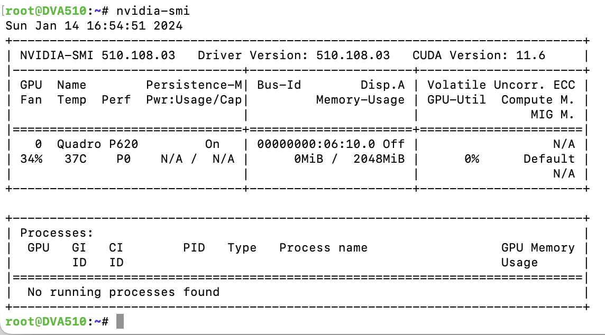

<br>

Con esta versión del controlador podemos instalarnos la última versión de nuestro servidor de medios, por ejemplo estamos usando la última de plex descargada directamentente de la página oficial.

<br>

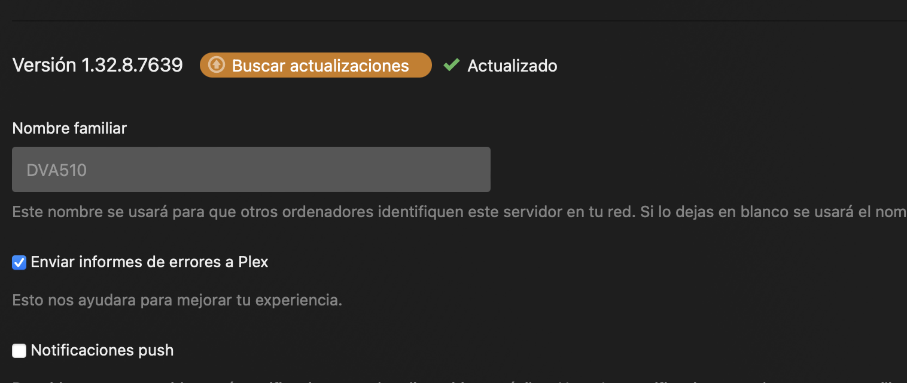

<br>

Podemos comprobar cómo está usando la gráfica correctamente.

<br>

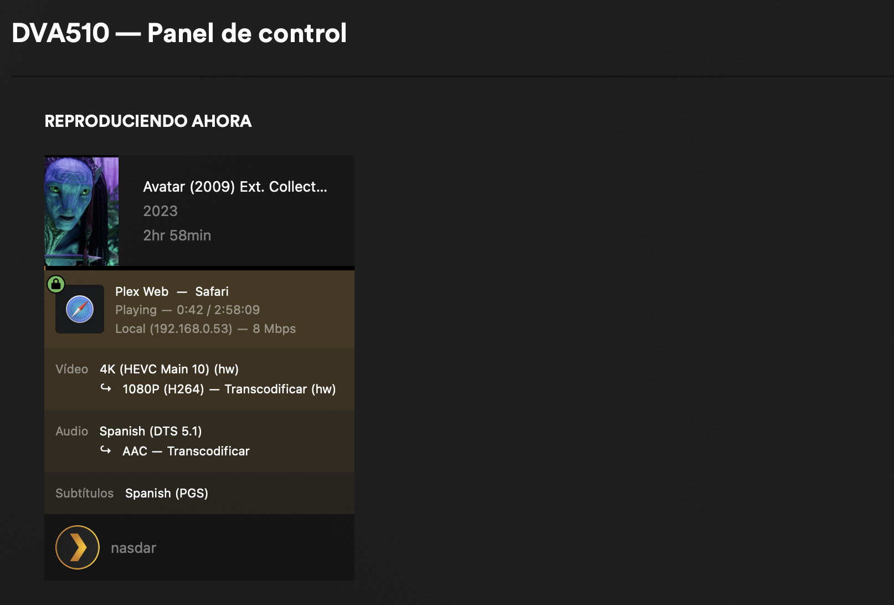

<br>

<br>

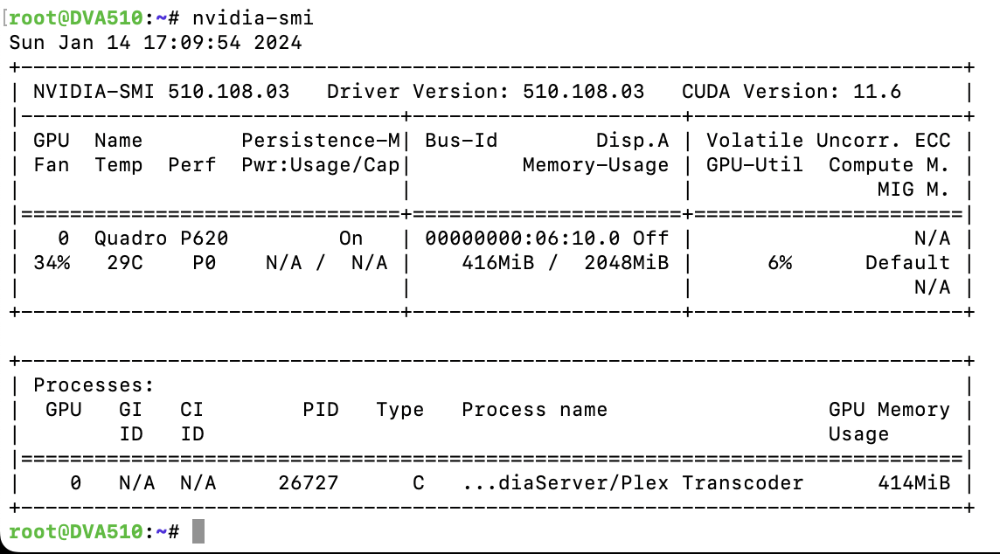

<br>

#

Otra ventaja muy interesante de este nuevo controlador es que ahora podemos usar Docker para aprovechar los recursos de la tarjeta gráfica NVIDIA, algo que no era posible con la versión anterior.
<br>
Por ejemplo, podríamos usar Dockers como [HWEncoderX](https://github.com/MacRimi/HWEncoderX/tree/main). 

[](https://github.com/MacRimi/HWEncoderX/tree/main)

```
docker run -d --name hwencoderx --gpus all \
  -v /path/to/input:/input \
  -v /path/to/output:/output \
  macrimi/hwencoderx:latest
```

#

### De momento este nuevo controlador no sirve para usar los recursos de video análisis de surveillance station.

Fuente original: https://blog.kkk.rs/archives/12

#

<div style="display: flex; justify-content: center; align-items: center;">
  <a href="https://ko-fi.com/G2G313ECAN" target="_blank" style="display: flex; align-items: center; text-decoration: none;">
    
  </a>
</div>
Si te ha gustado este tutorial, ¡puedes invitarme a un Ko-fi! ¡Gracias! 😊
