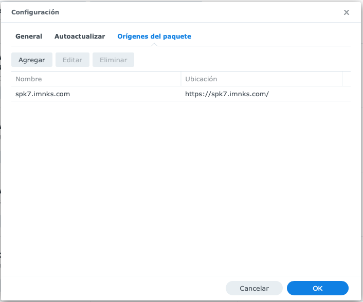

# Instalar  GPU nvidia y actualizar el controlador a la versión 510
#

En este tutorial vamos usar una tarjeta grafica nvidia e instalar el controlador 510.108.
 
Esta versión del controlador nos permitirá actualizar nuestros servidores de contenido como Plex, emby etc… y no tener la limitación que teníamos antes ya que estábamos usando el controlador 440.
 
El merito es del usuario: usuario: [pdbear · he/him](https://github.com/pdbear/syno_nvidia_gpu_driver) y del equpo de desarrollo de kkk.

Las tarjetas compatibles son las mismas que podriamos usar en los DVA.
 
Como característica especial:
 
- El controlador se actualiza a la versión: 510.108.03
- Funciona en la mayoia de modelos DSM cuya plataformas sean x86_64 con la versión del núcleo 4.4.302+. (7.2)

### Preparación:

Añadimos este repositorio de origenes de paquetes:

https://spk7.imnks.com/

Y nos instalamos el paquete NVIDIA GPU Driver 

